# Dynamic Readme
- To learn CI/CD with GitHub Actions and SVG animations. I've cloned the [jasonlong](https://github.com/jasonlong/jasonlong) repository to automate commits in a repository.
- It can be used for the main README of the GitHub profile.

## Setup
- Create the api key on [Visual Crossing](https://www.visualcrossing.com/weather-api).
- Add the api key on GitHub secrets (Settings > Security > Secrets and Variables > Actions > New Repository Secret). The api key must be named **API_KEY**.
- Grant permissions to the agent (Settings > Code and automation > Actions > General > Workflow permissions > Read and write permissions).
- Upload your photo to `dynamic-readme/helpers/assets/img.png` and it should be squared.
- Modify the data in the `config.py` file with your information.
- Run the template generator `python generate_template.py`.
- Run manually `python update_svg.py` for the first time.
- Add your LinkedIn profile URL to the link in the readme.
- Delete this comments and leave only the following image:
  

